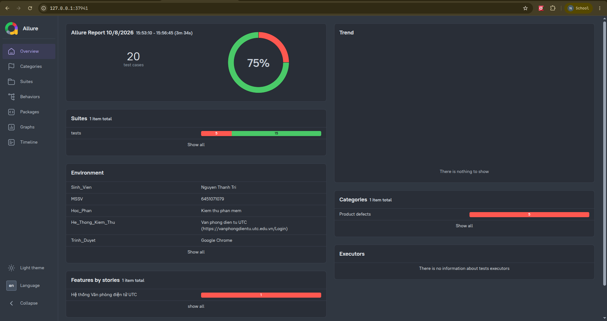

<div align="center">

# Kiểm Thử Tự Động Chức Năng Đăng Nhập


**Đồ án / Bài tập thực hành môn Kiểm Thử Phần Mềm**  
Kiểm thử tự động (Automation Testing) trang đăng nhập hệ thống Văn phòng điện tử — Trường Đại học Giao thông Vận tải (UTC).

</div>

---

## Thông Tin Sinh Viên

| Thông tin              | Chi tiết                                                                                                      |
| :--------------------- | :------------------------------------------------------------------------------------------------------------ |
| **Họ và tên**          | **Nguyễn Thành Trí**                                                                                          |
| **Mã số sinh viên**    | **6451071079**                                                                                                |
| **Học phần**           | Kiểm thử phần mềm                                                                                             |
| **Đối tượng kiểm thử** | [Văn phòng điện tử UTC](https://vanphongdientu.utc.edu.vn/Login?r=https%3A%2F%2Fvanphongdientu.utc.edu.vn%2F) |

---

## Giới Thiệu Dự Án

Dự án xây dựng bộ kiểm thử tự động (**Automation Test Suite**) sử dụng **Python**, **Selenium WebDriver 4**, **Pytest** và **Allure Report (`allure-pytest`)** nhằm kiểm tra toàn diện chức năng **Đăng nhập** tại cổng [Văn phòng điện tử UTC](https://vanphongdientu.utc.edu.vn/Login?r=https%3A%2F%2Fvanphongdientu.utc.edu.vn%2F).

### Điểm nổi bật trong thiết kế

- **Page Object Model (POM)**: Tách biệt hoàn toàn các bộ chọn phần tử giao diện (locators) và thao tác trang vào lớp `UTCLoginPage` (`pages/login_page.py`), giúp mã nguồn dễ bảo trì và tái sử dụng.
- **Dữ liệu hardcode trong từng file test**: Đặc tả và dữ liệu đầu vào của 20 kịch bản (`TC1` – `TC20`) được khai báo trực tiếp trong `tests/test_tc01.py` đến `tests/test_tc20.py`. File `resources/20_test_case_dang_nhap_UTC.json` chỉ là tài liệu nguồn tham khảo, không được đọc khi chạy test.
- **Báo cáo trực quan với Allure Report**: Tích hợp `@allure.step`, `@allure.epic`, `@allure.feature`, `@allure.story`, `@allure.severity`, tự động chụp ảnh màn hình trình duyệt (Screenshot) sau mỗi test case và đính kèm dữ liệu JSON vào báo cáo HTML.
- **Tách biệt từng kịch bản kiểm thử**: Mỗi test case được đóng gói trong một file độc lập (`tests/test_tc01.py` đến `tests/test_tc20.py`), dễ dàng chạy riêng lẻ hoặc chạy hàng loạt.

---

## Cấu Trúc Thư Mục

```text
kiem_thu_phan_mem/
├── .github/
│   └── workflows/ci.yml                   # GitHub Actions chạy Selenium và lưu báo cáo
├── pages/
│   └── login_page.py                      # Page Object Model (UTCLoginPage) tích hợp @allure.step
├── resources/
│   ├── 20_test_case_dang_nhap_UTC.json    # Tài liệu nguồn tham khảo, không được đọc khi chạy test
│   ├── login.html                         # Mã nguồn HTML mẫu của trang đăng nhập UTC
│   └── testcases.xlsx                     # Bảng đặc tả test case định dạng Excel
├── tests/
│   ├── test_tc01.py                       # TC1: Để trống tên đăng nhập
│   ├── test_tc02.py                       # TC2: Để trống mật khẩu
│   ├── test_tc03.py                       # TC3: Đúng tên đăng nhập, sai mật khẩu
│   ├── test_tc04.py                       # TC4: Sai tên đăng nhập, đúng mật khẩu
│   ├── test_tc05.py                       # TC5: Đăng nhập thành công & chọn "Giữ tôi luôn đăng nhập"
│   ├── test_tc06.py                       # TC6: Đăng nhập thành công & không chọn "Giữ tôi luôn đăng nhập"
│   ├── test_tc07.py                       # TC7: Để trống cả tên đăng nhập và mật khẩu
│   ├── test_tc08.py                       # TC8: Sai cả tên đăng nhập và mật khẩu
│   ├── test_tc09.py                       # TC9: Tên đăng nhập chỉ chứa khoảng trắng
│   ├── test_tc10.py                       # TC10: Mật khẩu chỉ chứa khoảng trắng
│   ├── test_tc11.py                       # TC11: Mật khẩu phân biệt chữ hoa và chữ thường
│   ├── test_tc12.py                       # TC12: Đăng nhập bằng phím Enter
│   ├── test_tc13.py                       # TC13: Kiểm tra chức năng che mật khẩu
│   ├── test_tc14.py                       # TC14: Tên đăng nhập không tồn tại
│   ├── test_tc15.py                       # TC15: Nhập mật khẩu quá dài
│   ├── test_tc16.py                       # TC16: Kiểm tra chức năng quên mật khẩu
│   ├── test_tc17.py                       # TC17: Kiểm tra đăng nhập bằng e-mail UTC (Google OAuth)
│   ├── test_tc18.py                       # TC18: Làm mới trang (F5) sau khi đăng nhập
│   ├── test_tc19.py                       # TC19: Đăng xuất sau khi đăng nhập thành công
│   └── test_tc20.py                       # TC20: Kiểm tra bảo mật SQL Injection
├── reports/
│   ├── allure-results/                    # Dữ liệu JSON kết quả chạy kiểm thử do allure-pytest sinh ra
│   └── allure-report/                     # Báo cáo HTML tĩnh được xuất ra từ Allure CLI
├── conftest.py                            # Cấu hình WebDriver, hook chụp ảnh màn hình & thông tin Allure
├── main.py                                # Điểm vào chạy nhanh toàn bộ bộ kiểm thử bằng Python
├── pytest.ini                             # Cấu hình Pytest tự động xuất kết quả ra reports/allure-results
├── requirements.txt                       # Danh sách thư viện (selenium, pytest, webdriver-manager, allure-pytest)
└── README.md                              # Tài liệu hướng dẫn dự án
```

---

## Hướng Dẫn Cài Đặt & Thiết Lập (Setup)

### 1. Yêu cầu hệ thống

- **Python**: Phiên bản `3.10` trở lên
- **Java (JRE/JDK)**: Phiên bản `8` trở lên (để chạy công cụ xuất báo cáo Allure CLI)
- **Trình duyệt**: Google Chrome hoặc Chromium

### 2. Khởi tạo môi trường ảo (Virtual Environment)

```bash
# Tạo môi trường ảo .venv
python3 -m venv .venv

# Kích hoạt môi trường ảo (Linux / macOS)
source .venv/bin/activate

# Hoặc kích hoạt trên Windows (PowerShell)
.venv\Scripts\Activate.ps1
```

### 3. Cài đặt thư viện phụ thuộc

```bash
pip install -r requirements.txt
```

---

## Hướng Dẫn Chạy Kiểm Thử & Xem Báo Cáo Allure

Nhờ cấu hình sẵn `--alluredir=reports/allure-results --clean-alluredir` trong `pytest.ini`, mỗi lần chạy `pytest` dữ liệu báo cáo sẽ tự động được ghi vào thư mục `reports/allure-results/`.

### 1. Chạy kiểm thử với Pytest

```bash
# Chạy toàn bộ 20 test case (hiển thị trình duyệt Chrome)
pytest

# Chạy toàn bộ 20 test case ở chế độ ẩn trình duyệt (Headless)
pytest --headless

# Chạy riêng một hoặc một vài test case cụ thể
pytest tests/test_tc01.py --headless
```

### 2. Tạo và xem báo cáo Allure Report

Sau khi chạy xong `pytest`, sử dụng lệnh `allure` (đã được cài sẵn trong `.venv/bin/allure`) để xem báo cáo trực quan trên trình duyệt:

```bash
# Cách 1: Khởi chạy web server tạm thời và tự động mở báo cáo Allure trên trình duyệt
allure serve reports/allure-results

# Cách 2: Xuất báo cáo ra thư mục HTML tĩnh (reports/allure-report)
allure generate reports/allure-results -o reports/allure-report --clean

# Mở báo cáo HTML tĩnh đã xuất
allure open reports/allure-report
```

<div align="center" ></img></div>

### 3. Chạy tự động với GitHub Actions

Workflow `.github/workflows/ci.yml` chạy khi push, mở hoặc cập nhật pull request, và có thể chạy thủ công tại **Actions → UTC Login Tests → Run workflow**.

CI sử dụng Ubuntu 24.04, Python 3.12 và Chrome/ChromeDriver có sẵn trên runner. Sau khi cài `requirements.txt`, CI chạy đủ 20 test bằng lệnh:

```bash
python -m pytest --headless --junitxml=reports/junit.xml
```

Test dùng dữ liệu hardcode trong từng file test và truy cập website UTC thật. Kết quả phụ thuộc vào khả năng truy cập website và tính hợp lệ của tài khoản trong các kịch bản đăng nhập thành công; test thất bại sẽ khiến CI thất bại.

Dữ liệu Allure (kèm ảnh chụp màn hình) và báo cáo JUnit được lưu trong artifact **utc-login-test-reports** trong 14 ngày, kể cả khi test thất bại. Tải artifact ở trang chi tiết lần chạy, giải nén rồi xem Allure bằng:

```bash
allure serve allure-results
```

---

## Danh Sách 20 Kịch Bản Kiểm Thử

|  Mã TC   | File Test            | Mô tả kịch bản                                               | Dữ liệu mẫu (`Username` / `Password`)   | Kỳ vọng                                                 |
| :------: | :------------------- | :----------------------------------------------------------- | :-------------------------------------- | :------------------------------------------------------ |
| **TC1**  | `tests/test_tc01.py` | Để trống tên đăng nhập                                       | `""` / `"123456@utc"`                   | Báo lỗi _"Bạn chưa nhập tên đăng nhập"_                 |
| **TC2**  | `tests/test_tc02.py` | Để trống mật khẩu                                            | `"huongnt"` / `""`                      | Báo lỗi _"Bạn chưa nhập mật khẩu"_                      |
| **TC3**  | `tests/test_tc03.py` | Đúng tên đăng nhập, sai mật khẩu                             | `"huongnt"` / `"123456@utc"`            | Báo lỗi _"Tài khoản hoặc mật khẩu không đúng."_         |
| **TC4**  | `tests/test_tc04.py` | Sai tên đăng nhập, đúng mật khẩu                             | `"user_invalid"` / `"123456@utc"`       | Báo lỗi _"Tài khoản hoặc mật khẩu không đúng."_         |
| **TC5**  | `tests/test_tc05.py` | Đăng nhập thành công & chọn _"Giữ tôi luôn đăng nhập"_       | `"huongnt"` / `"123456@utc"`            | Chuyển vào trang chủ & duy trì phiên khi mở lại         |
| **TC6**  | `tests/test_tc06.py` | Đăng nhập thành công & không chọn _"Giữ tôi luôn đăng nhập"_ | `"huongnt"` / `"123456@utc"`            | Chuyển vào trang chủ & yêu cầu đăng nhập lại khi mở mới |
| **TC7**  | `tests/test_tc07.py` | Để trống cả tên đăng nhập và mật khẩu                        | `""` / `""`                             | Báo lỗi _"Bạn chưa nhập tên đăng nhập"_                 |
| **TC8**  | `tests/test_tc08.py` | Sai cả tên đăng nhập và mật khẩu                             | `"user_invalid"` / `"123456@utc"`       | Báo lỗi _"Tài khoản hoặc mật khẩu không đúng."_         |
| **TC9**  | `tests/test_tc09.py` | Tên đăng nhập chỉ chứa khoảng trắng                          | `"   "` / `"123456@utc"`                | Từ chối đăng nhập và hiển thị thông báo lỗi             |
| **TC10** | `tests/test_tc10.py` | Mật khẩu chỉ chứa khoảng trắng                               | `"huongnt"` / `"   "`                   | Từ chối đăng nhập và hiển thị thông báo lỗi             |
| **TC11** | `tests/test_tc11.py` | Mật khẩu phân biệt chữ hoa và chữ thường                     | `"huongnt"` / `"123456@UTC"`            | Báo lỗi _"Tài khoản hoặc mật khẩu không đúng."_         |
| **TC12** | `tests/test_tc12.py` | Đăng nhập bằng phím `Enter`                                  | `"huongnt"` / `"123456@utc"`            | Gửi biểu mẫu và đăng nhập vào trang chủ                 |
| **TC13** | `tests/test_tc13.py` | Kiểm tra chức năng che mật khẩu                              | `"123456@utc"`                          | Thuộc tính ô mật khẩu có `type="password"`              |
| **TC14** | `tests/test_tc14.py` | Tên đăng nhập không tồn tại                                  | `"nonexistent_user_12345"` / `"123456"` | Báo lỗi _"Tài khoản hoặc mật khẩu không đúng."_         |
| **TC15** | `tests/test_tc15.py` | Nhập mật khẩu quá dài (300 ký tự)                            | `"huongnt"` / `"a" * 300`               | Từ chối đăng nhập, không phát sinh lỗi máy chủ          |
| **TC16** | `tests/test_tc16.py` | Kiểm tra chức năng quên mật khẩu                             | Click _"Bạn quên mật khẩu đăng nhập ?"_ | Điều hướng tới `/Login/GetPass`                         |
| **TC17** | `tests/test_tc17.py` | Kiểm tra đăng nhập bằng e-mail UTC                           | Click _"Đăng nhập bằng e-mail UTC"_     | Chuyển hướng tới trang xác thực Google OAuth            |
| **TC18** | `tests/test_tc18.py` | Làm mới trang (`F5`) sau khi đăng nhập                       | `"huongnt"` / `"123456@utc"`            | Duy trì phiên đăng nhập sau khi refresh                 |
| **TC19** | `tests/test_tc19.py` | Đăng xuất sau khi đăng nhập thành công                       | `"huongnt"` / `"123456@utc"`            | Hủy phiên và yêu cầu đăng nhập lại khi truy cập         |
| **TC20** | `tests/test_tc20.py` | Kiểm tra đăng nhập bằng SQL Injection                        | `"' OR '1'='1"` / `"123456"`            | Chặn đăng nhập trái phép, không rò rỉ lỗi CSDL          |
